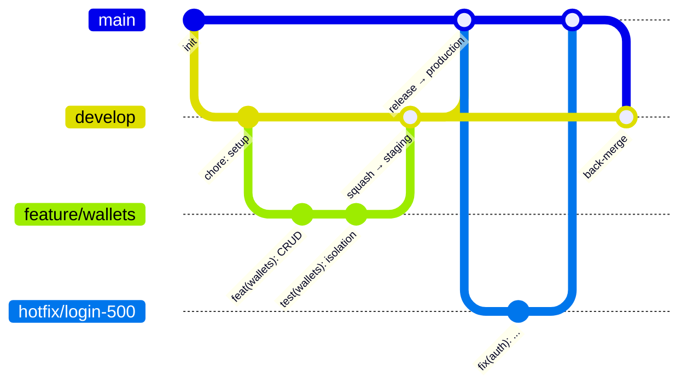

# Contributing

## 1. Branch strategy



| Branch                 | มาจาก     | merge เข้า                            | Deploy     | หมายเหตุ                                                   |
| ---------------------- | --------- | ------------------------------------- | ---------- | ---------------------------------------------------------- |
| `main`                 | –         | –                                     | production | protected, merge ผ่าน PR เท่านั้น, deploy ต้องมีคน approve |
| `develop`              | `main`    | `main`                                | staging    | protected, merge ผ่าน PR เท่านั้น                          |
| `feature/<short-name>` | `develop` | `develop`                             | –          | เช่น `feature/quick-add`                                   |
| `fix/<short-name>`     | `develop` | `develop`                             | –          | บั๊กที่ยังไม่ขึ้น production                               |
| `hotfix/<short-name>`  | `main`    | `main` แล้ว back-merge เข้า `develop` | –          | บั๊กด่วนบน production                                      |

### Merge strategy

| PR                                | วิธี merge                | เหตุผล                                                                                  |
| --------------------------------- | ------------------------- | --------------------------------------------------------------------------------------- |
| `feature/*` / `fix/*` → `develop` | **Squash and merge**      | 1 PR = 1 commit บน develop ทำให้อ่าน history และ revert ง่าย                            |
| `develop` → `main`                | **Create a merge commit** | ถ้า squash ตรงนี้ `main` กับ `develop` จะมี commit คนละชุด และ PR ครั้งถัดไปจะ conflict |

## 2. Conventional Commits

รูปแบบ: `<type>(<scope>): <subject>` (subject เป็นภาษาอังกฤษ, ขึ้นต้นด้วยกริยารูปปกติ, ไม่มีจุดท้าย)

| type       | ใช้เมื่อ                             |
| ---------- | ------------------------------------ |
| `feat`     | เพิ่มความสามารถใหม่                  |
| `fix`      | แก้บั๊ก                              |
| `refactor` | ปรับโค้ดโดยพฤติกรรมไม่เปลี่ยน        |
| `perf`     | ปรับประสิทธิภาพ                      |
| `test`     | เพิ่ม/แก้ test                       |
| `docs`     | เอกสาร                               |
| `build`    | dependencies, Dockerfile, build tool |
| `ci`       | GitHub Actions                       |
| `chore`    | งานบำรุงรักษาอื่นๆ                   |

**Scopes:** `api`, `web`, `shared`, `db`, `auth`, `wallets`, `categories`, `transactions`, `budgets`, `reports`, `tags`, `recurring`, `attachments`, `deploy`

ตัวอย่าง

```
feat(transactions): add CSV export with UTF-8 BOM
fix(budgets): include child categories in parent spent amount
build(api): add multi-stage Dockerfile
```

Breaking change: ใส่ `!` เช่น `feat(api)!: return ids as strings` และอธิบายใน body ด้วย `BREAKING CHANGE: ...`

เพราะเรา squash merge **ชื่อ PR จะกลายเป็น commit message** จึงต้องตั้งชื่อ PR ให้ตรงรูปแบบ

## 3. Workflow

```bash
git switch develop
git pull
git switch -c feature/quick-add

# ... เขียนโค้ด ...
npm run lint && npm run format:check && npm run typecheck && npm test

git add -A
git commit -m "feat(web): add quick add modal"
git push -u origin feature/quick-add
# เปิด PR เข้า develop บน GitHub
```

## 4. Branch protection (ตั้งบน GitHub)

**Settings → Rules → Rulesets → New branch ruleset**

| ช่อง               | ค่า                                                    |
| ------------------ | ------------------------------------------------------ |
| Ruleset name       | `protect-main-develop`                                 |
| Enforcement status | **Active**                                             |
| Target branches    | Add target → Include by pattern → `main` และ `develop` |

เปิด rule ต่อไปนี้:

- ✅ **Restrict deletions**
- ✅ **Block force pushes**
- ✅ **Require a pull request before merging**
  - Required approvals = **0** — GitHub ไม่ให้เจ้าของ PR approve PR ของตัวเอง ถ้าตั้งเป็น 1 นักพัฒนาคนเดียวจะ merge เข้า `main` ไม่ได้เลย ด่านที่ต้องมีคนกดยืนยันก่อนขึ้น production อยู่ที่ **GitHub Environment `production`** (Phase 12) แทน
- ✅ **Require status checks to pass**
  - ✅ Require branches to be up to date before merging
  - Add checks — **เพียง 2 ตัว** (gate ของแต่ละแอป ดู [docs/cicd.md](docs/cicd.md)):
    - `api-ci-passed`
    - `web-ci-passed`

> ถ้าไม่ได้เพิ่ม check ใน "Require status checks" CI จะแค่แสดงกากบาทสีแดง แต่ยัง **merge ได้อยู่ดี**
> การตั้ง ruleset นี้คือสิ่งที่ทำให้ "PR ที่ test พัง merge ไม่ได้" จริงๆ

## 5. CI/CD

แยก pipeline ของ **API** และ **เว็บ** และแยก **staging** กับ **production** รายละเอียดทั้งหมดอยู่ใน [docs/cicd.md](docs/cicd.md)

| สิ่งที่ต้องทำก่อน push | คำสั่ง                                                                                                                                                                    |
| ---------------------- | ------------------------------------------------------------------------------------------------------------------------------------------------------------------------- |
| API                    | `npm run db:generate -w @income-expenses/api && npx eslint apps/api packages/shared && npm run typecheck -w @income-expenses/api && npm run test -w @income-expenses/api` |
| เว็บ                   | `npx eslint apps/web packages/shared && npm run typecheck -w @income-expenses/web && npm test -w @income-expenses/web`                                                    |
| ทั้งคู่                | `npm run format:check`                                                                                                                                                    |
