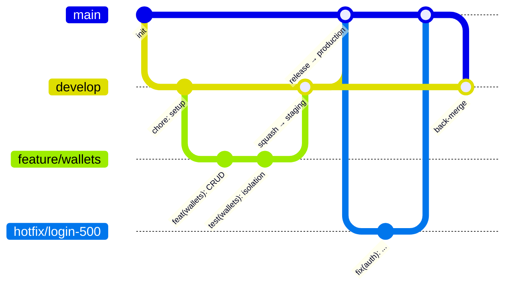

# Contributing

## 1. Branch strategy



| Branch                 | มาจาก     | merge เข้า                            | Deploy     | หมายเหตุ                                             |
| ---------------------- | --------- | ------------------------------------- | ---------- | ---------------------------------------------------- |
| `main`                 | –         | –                                     | production | protected, merge ผ่าน PR เท่านั้น + ต้องมีคน approve |
| `develop`              | `main`    | `main`                                | staging    | protected, merge ผ่าน PR เท่านั้น                    |
| `feature/<short-name>` | `develop` | `develop`                             | –          | เช่น `feature/quick-add`                             |
| `fix/<short-name>`     | `develop` | `develop`                             | –          | บั๊กที่ยังไม่ขึ้น production                         |
| `hotfix/<short-name>`  | `main`    | `main` แล้ว back-merge เข้า `develop` | –          | บั๊กด่วนบน production                                |

### Merge strategy

| PR                                | วิธี merge                | เหตุผล                                                                                  |
| --------------------------------- | ------------------------- | --------------------------------------------------------------------------------------- |
| `feature/*` / `fix/*` → `develop` | **Squash and merge**      | 1 PR = 1 commit บน develop ทำให้อ่าน history และ revert ง่าย                            |
| `develop` → `main`                | **Create a merge commit** | ถ้า squash ตรงนี้ `main` กับ `develop` จะมี commit คนละชุด และ PR ครั้งถัดไปจะ conflict |

## 2. Conventional Commits

รูปแบบ: `<type>(<scope>): <subject>` (subject เป็นภาษาอังกฤษ, ขึ้นต้นด้วยกริยารูปปกติ, ไม่มีจุดท้าย)

| type       | ใช้เมื่อ                             |
| ---------- | ------------------------------------ |
| `feat`     | เพิ่มความสามารถใหม่                  |
| `fix`      | แก้บั๊ก                              |
| `refactor` | ปรับโค้ดโดยพฤติกรรมไม่เปลี่ยน        |
| `perf`     | ปรับประสิทธิภาพ                      |
| `test`     | เพิ่ม/แก้ test                       |
| `docs`     | เอกสาร                               |
| `build`    | dependencies, Dockerfile, build tool |
| `ci`       | GitHub Actions                       |
| `chore`    | งานบำรุงรักษาอื่นๆ                   |

**Scopes:** `api`, `web`, `shared`, `db`, `auth`, `wallets`, `categories`, `transactions`, `budgets`, `reports`, `tags`, `recurring`, `attachments`, `deploy`

ตัวอย่าง

```
feat(transactions): add CSV export with UTF-8 BOM
fix(budgets): include child categories in parent spent amount
build(api): add multi-stage Dockerfile
```

Breaking change: ใส่ `!` เช่น `feat(api)!: return ids as strings` และอธิบายใน body ด้วย `BREAKING CHANGE: ...`

เพราะเรา squash merge **ชื่อ PR จะกลายเป็น commit message** จึงต้องตั้งชื่อ PR ให้ตรงรูปแบบ

## 3. Workflow

```bash
git switch develop
git pull
git switch -c feature/quick-add

# ... เขียนโค้ด ...
npm run lint && npm run format:check && npm run typecheck && npm test

git add -A
git commit -m "feat(web): add quick add modal"
git push -u origin feature/quick-add
# เปิด PR เข้า develop บน GitHub
```

## 4. Branch protection (ตั้งบน GitHub)

Settings → Branches → Add branch ruleset สำหรับ `main` และ `develop`:

- ✅ Restrict deletions
- ✅ Require a pull request before merging (`main`: Required approvals = 1)
- ✅ Require status checks to pass (เพิ่ม job ของ CI หลัง Phase 10)
- ✅ Block force pushes
