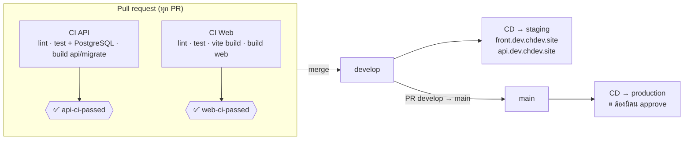
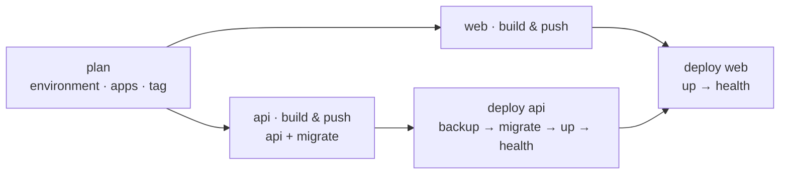
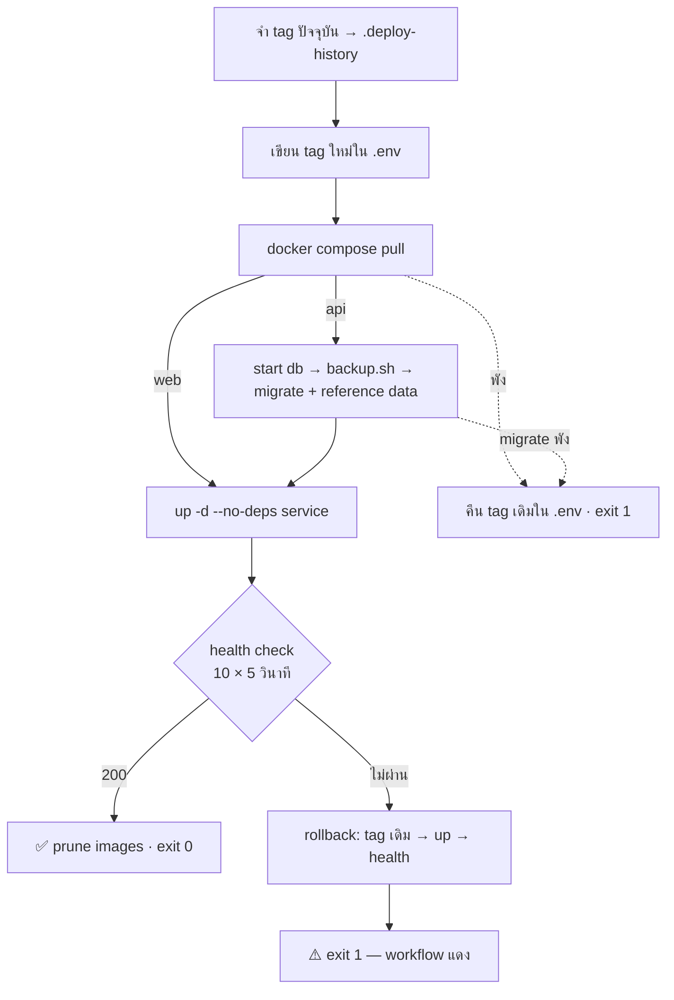

# CI/CD — API และ Frontend แยกกัน, staging และ production แยกกัน

เอกสารนี้อธิบายทุก workflow ใน `.github/workflows/` วิธีตั้งค่าบน GitHub และวิธี deploy/rollback ด้วยมือ

## 1. ภาพรวม



| ไฟล์                    | Trigger                               | หน้าที่                                                             |
| ----------------------- | ------------------------------------- | ------------------------------------------------------------------- |
| `ci-api.yml`            | ทุก PR                                | ตรวจ API ถ้ามีไฟล์ที่เกี่ยวข้องเปลี่ยน → gate `api-ci-passed`       |
| `ci-web.yml`            | ทุก PR                                | ตรวจเว็บ ถ้ามีไฟล์ที่เกี่ยวข้องเปลี่ยน → gate `web-ci-passed`       |
| `cd.yml`                | push `develop` / `main`, หรือกดรันเอง | build + push image ของแอปที่เปลี่ยน → deploy API → deploy Web       |
| `_deploy.yml`           | ถูกเรียกจาก `cd.yml`                  | deploy **1 แอป** ไป **1 environment** ผ่าน SSH (`deploy/deploy.sh`) |
| `.github/filters.yml`   | –                                     | กำหนดว่าไฟล์ไหนเป็นของ API, ของเว็บ, หรือของทั้งคู่                 |
| `.github/actions/setup` | –                                     | composite action: Node จาก `.nvmrc` + npm cache + `npm ci`          |

### ไฟล์ไหนเป็นของใคร (`.github/filters.yml`)

| เปลี่ยนไฟล์ใน                                                       | CI API | CI Web | CD build/deploy |
| ------------------------------------------------------------------- | :----: | :----: | --------------- |
| `apps/api/**`                                                       |   ✅   |   –    | api             |
| `apps/web/**`                                                       |   –    |   ✅   | web             |
| `packages/shared/**`, `package-lock.json`, tsconfig/eslint/prettier |   ✅   |   ✅   | api + web       |
| `deploy/**`, `cd.yml`, `_deploy.yml`                                |   ✅   |   ✅   | api + web       |
| `docs/**`, `README.md`                                              |   –    |   –    | ไม่ deploy      |

## 2. CI (pull request)

### ทำไม "ทุก PR" แทนที่จะใช้ `paths:` ที่ trigger?

ถ้าเขียน `on: pull_request: paths: ['apps/api/**']` แล้ว PR ที่แก้เฉพาะเว็บ check ของ API **จะไม่รันเลย** แต่ ruleset ยังรอ check นั้นอยู่ PR จึงค้าง "Expected — Waiting for status" ตลอดไป

เราจึงรัน workflow ทุก PR แล้วให้ job `changes` (dorny/paths-filter) ตัดสินใจภายใน job ที่ถูกข้ามจะเป็น **skipped** และ gate job (`if: always()`) จะผ่าน ถ้าไม่มี job ไหน **failure** หรือ **cancelled**

> 💡 **Interview note:** ruleset ควรบังคับแค่ **check เดียวต่อแอป** (gate) ไม่ใช่ทุก job เพิ่มหรือเปลี่ยนชื่อ job ภายใน workflow ได้โดยไม่ต้องไปแก้ ruleset

### CI API

| Job                                 | รายละเอียด                                                                                      |
| ----------------------------------- | ----------------------------------------------------------------------------------------------- |
| `detect API changes`                | paths-filter                                                                                    |
| `api · lint & typecheck`            | `prisma generate` → ESLint (api + shared) → Prettier (ทั้ง repo) → `tsc`                        |
| `api · test (PostgreSQL 16)`        | service container → `prisma migrate deploy` → Vitest + coverage ≥ 70% → artifact `api-coverage` |
| `api · build image (api / migrate)` | buildx + GHA cache, **ไม่ push**                                                                |
| `api-ci-passed`                     | gate (required check)                                                                           |

### CI Web

| Job                       | รายละเอียด                                     |
| ------------------------- | ---------------------------------------------- |
| `detect web changes`      | paths-filter                                   |
| `web · lint & typecheck`  | ESLint (web + shared) → Prettier → `tsc`       |
| `web · test`              | Vitest + Testing Library                       |
| `web · production bundle` | `vite build` + ตารางขนาด bundle ใน job summary |
| `web · build image`       | buildx + GHA cache, ไม่ push                   |
| `web-ci-passed`           | gate (required check)                          |

## 3. CD (หลัง merge)



| branch    | environment  | tag ที่ push        | approve                                        |
| --------- | ------------ | ------------------- | ---------------------------------------------- |
| `develop` | `staging`    | `<sha>` + `staging` | ไม่ต้อง                                        |
| `main`    | `production` | `<sha>` + `latest`  | **ต้อง** (Required reviewers) ทั้ง api และ web |

- **deploy เฉพาะแอปที่เปลี่ยน:** แก้แค่เว็บ → build และ deploy แค่เว็บ
- **API ก่อนเว็บเสมอ:** เว็บเวอร์ชันใหม่อาจเรียก endpoint ใหม่ ถ้า deploy API ไม่ผ่าน เว็บจะไม่ถูก deploy
- **production approve 2 จังหวะ:** approve API → รอ healthy → approve เว็บ ทำให้ตรวจ API ใหม่ได้ก่อนปล่อยหน้าเว็บ
- `concurrency: deploy-<env>` ป้องกันการ deploy 2 ตัวพร้อมกันใน environment เดียว และจะไม่ยกเลิกตัวที่กำลังรันอยู่

### สิ่งที่ `deploy/deploy.sh` ทำ (บน server)



deploy แต่ละตัว **ตรวจหน่วยของตัวเอง** deploy ครั้งแรกจึงทำได้ไม่ว่าจะ deploy ตัวไหนก่อน

| health check | ตรวจอะไร                                                                                                                             |
| ------------ | ------------------------------------------------------------------------------------------------------------------------------------ |
| api          | `/api/v1/ready` จาก**ใน container** (API + DB) และถ้า web deploy แล้ว ตรวจ `https://$API_DOMAIN/api/v1/ready` ผ่าน nginx ทั้งสายด้วย |
| web          | `https://$APP_DOMAIN/healthz` และถ้า api deploy แล้ว ตรวจ `https://$APP_DOMAIN/api/v1/ready` ด้วย (end-to-end)                       |

ทำไมไม่ใช้ URL สาธารณะอย่างเดียว: API เข้าถึงได้เฉพาะผ่าน nginx ของ web container ใน deploy ครั้งแรกบน staging (2026-10-01)
ตอนที่ web ยังไม่มี health check ของ API จึงได้ 502 ทุกครั้ง ทั้งที่ API ทำงานปกติ

deploy ครั้งแรกที่ไม่ผ่าน health check → ไม่มีเวอร์ชันให้ rollback → `deploy.sh` จะหยุด container ตัวนั้น และคืนค่า tag ใน `.env` ให้ตรงกับความจริง

ทดสอบบนเครื่องแล้วทั้ง 4 กรณี: deploy ครั้งแรก, API ครั้งแรก (มี backup + migrate), **release ที่ crash → rollback อัตโนมัติ**, migration fail → container ไม่ถูกแตะ + `.env` ถูกคืนค่า
และ deploy จริงครั้งแรกบน staging ผ่านแล้ว (API ก่อน แล้วตามด้วย web)

> ⚠️ **Rollback ย้อนได้แค่ image ไม่ย้อน migration** migration ทุกตัวจึงต้อง backward compatible (expand → migrate → contract) ถ้าจำเป็นต้องย้อน schema จริงๆ ให้ restore จาก `backups/db-*-pre-deploy-*.sql.gz` ที่ deploy.sh สร้างไว้ก่อนทุกครั้ง

## 4. ตั้งค่าบน GitHub (ทำครั้งเดียว)

### 4.1 Environments — Settings → Environments

| Environment  | Protection                         | Deployment branches |
| ------------ | ---------------------------------- | ------------------- |
| `staging`    | –                                  | `develop`           |
| `production` | ✅ **Required reviewers** (ตัวคุณ) | `main`              |

แต่ละ environment ต้องมี:

| ประเภท   | ชื่อ                   | staging (ตัวอย่าง)                     | คำอธิบาย                                                                      |
| -------- | ---------------------- | -------------------------------------- | ----------------------------------------------------------------------------- |
| secret   | `SSH_HOST`             | `187.77.150.239`                       | IP ของ server                                                                 |
| secret   | `SSH_PORT`             | `22`                                   |                                                                               |
| secret   | `SSH_USER`             | `deploy`                               | user ที่อยู่ในกลุ่ม `docker` (Phase 11)                                       |
| secret   | `SSH_PRIVATE_KEY`      | _(private key สำหรับ deploy โดยเฉพาะ)_ | สร้างใหม่ อย่าใช้ key ส่วนตัว                                                 |
| secret   | `SSH_HOST_FINGERPRINT` | `SHA256:…`                             | `ssh-keyscan -t ed25519 <host> \| ssh-keygen -lf -` ใช้ pin host key กัน MITM |
| variable | `APP_DOMAIN`           | `front.dev.chdev.site`                 |                                                                               |
| variable | `API_DOMAIN`           | `api.dev.chdev.site`                   |                                                                               |
| variable | `DEPLOY_PATH`          | `/opt/income-expenses/staging`         |                                                                               |

### 4.2 เปิด deploy — Settings → Secrets and variables → Actions → Variables

`DEPLOY_ENABLED` = `true` ให้ตั้ง **หลัง** server และ environments พร้อมแล้ว ก่อนหน้านั้น CD จะ build และ push image อย่างเดียว

### 4.3 Branch ruleset — required checks

`api-ci-passed` และ `web-ci-passed` (แทน 6 check เดิม)

### 4.4 Server ต้องดึง image จาก ghcr ได้

package จะเป็น **private** ตอนถูกสร้างครั้งแรก เลือกทางใดทางหนึ่ง:

- ทำ package เป็น public: GitHub → Packages → `income-expenses-*` → Package settings → Change visibility (ทำได้เพราะ repo เป็น public)
- หรือบน server: `echo <PAT read:packages> | docker login ghcr.io -u <user> --password-stdin`

## 5. Deploy และ rollback ด้วยมือ

**ผ่าน GitHub (แนะนำ):** Actions → **CD** → Run workflow

- `environment`: staging / production
- `service`: both / api / web
- `image-tag`: SHA ที่ต้องการ (เว้นว่าง = build จาก branch ที่เลือก)

ตัวอย่างการ rollback เว็บ production ไปเวอร์ชันก่อน: environment=`production`, service=`web`, image-tag=`<sha เก่า>` (ดู SHA ได้จาก `.deploy-history` บน server หรือจากหน้า Packages)

**บน server:**

```bash
cd /opt/income-expenses/staging
cat .deploy-history              # เวอร์ชันที่เคยรัน
./deploy.sh api <sha>            # หรือ ./deploy.sh web <sha>
```

## 6. แก้ปัญหา

| อาการ                                          | สาเหตุที่พบบ่อย                                       | วิธีแก้                                                   |
| ---------------------------------------------- | ----------------------------------------------------- | --------------------------------------------------------- |
| PR ค้าง "Expected — Waiting for status"        | ruleset บังคับชื่อ check ที่ไม่มีแล้ว                 | ruleset ต้องมีแค่ `api-ci-passed`, `web-ci-passed`        |
| CD เขียว แต่ไม่มี deploy job                   | `DEPLOY_ENABLED` ไม่ใช่ `true`                        | ดู job summary ของ `plan`                                 |
| `pull access denied` บน server                 | package ghcr ยังเป็น private                          | ข้อ 4.4                                                   |
| `ssh: handshake failed` / fingerprint mismatch | `SSH_HOST_FINGERPRINT` ผิด หรือ server ถูกติดตั้งใหม่ | เช็ก `ssh-keyscan` แล้วอัปเดต secret                      |
| deploy API แดงพร้อม "Rolled back"              | release ใหม่ไม่ healthy                               | ดู log ใน job, container รันเวอร์ชันเดิมอยู่แล้ว          |
| migration failed                               | SQL ผิด หรือ constraint ชนกับข้อมูลจริง               | แก้ migration แล้ว deploy ใหม่ (container เดิมยังรันอยู่) |
