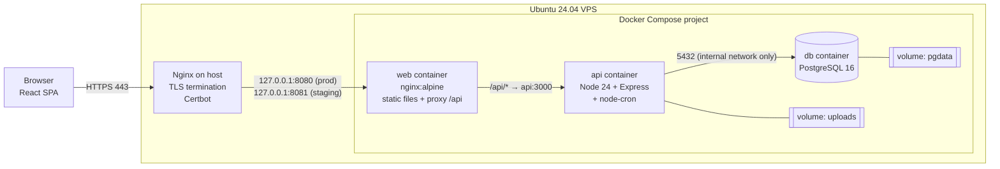
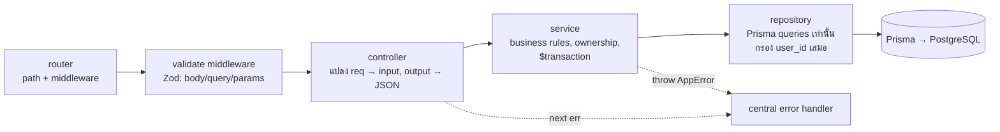
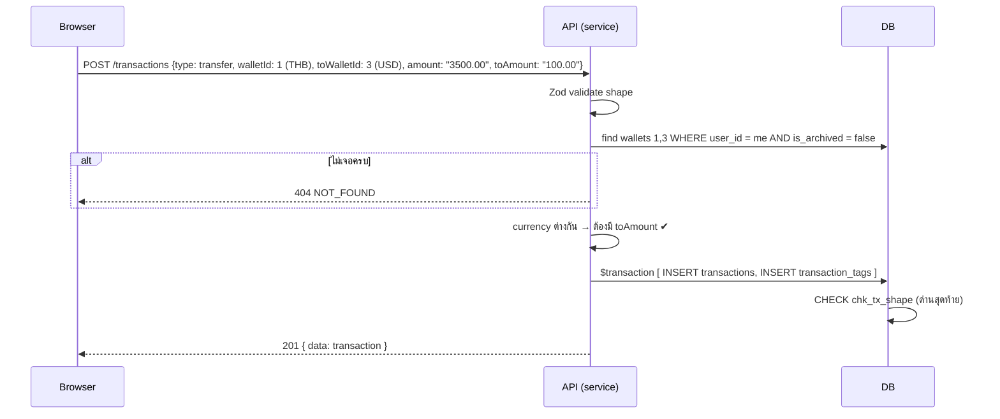
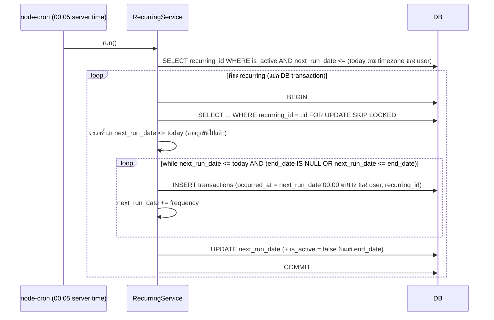

# Design Doc — Income & Expenses

|                  |                                         |
| ---------------- | --------------------------------------- |
| **Status**       | Draft (Phase 0)                         |
| **Last updated** | 2026-09-30                              |
| **Related docs** | [erd.md](./erd.md) · [api.md](./api.md) |

---

## 1. Context & Problem

คนส่วนใหญ่ไม่รู้ว่าเงินหายไปไหนในแต่ละเดือน เพราะเงินกระจายอยู่หลายที่ (เงินสด, บัญชีธนาคาร, e-wallet, บัตรเครดิต)
แอปจดรายจ่ายทั่วไปมักมีปัญหาอย่างใดอย่างหนึ่งต่อไปนี้:

- **จดช้า** — ต้องกดหลายหน้าจอ สุดท้ายเลยเลิกจด
- **ไม่เห็นภาพรวม** — ต้องเปิดดูทีละบัญชี
- **รู้ตัวช้า** — รู้ว่าใช้เกินงบก็ตอนสิ้นเดือนไปแล้ว

## 2. Goals / Non-goals

### 2.1 Goals (MVP)

| #   | Goal                                | วัดผลอย่างไร                                                                      |
| --- | ----------------------------------- | --------------------------------------------------------------------------------- |
| G1  | บันทึกรายการได้ภายใน 5 วินาที       | Quick Add: กด `N` → พิมพ์จำนวน → เลือกหมวด → Enter (กระเป๋าจำค่าล่าสุดไว้ให้แล้ว) |
| G2  | เห็นยอดคงเหลือทุกกระเป๋าในหน้าเดียว | Dashboard แสดงทุก wallet พร้อม balance                                            |
| G3  | รู้ทันทีว่าเดือนนี้ใช้เกินงบหมวดไหน | Dashboard + หน้า Budgets แสดงสถานะ ok / warning / over                            |
| G4  | ข้อมูลของแต่ละคนแยกกันเด็ดขาด       | Integration test เรื่อง data isolation ครบทุก module                              |

### 2.2 Non-goals (ยังไม่ทำใน MVP)

- **แปลงสกุลเงินอัตโนมัติ** (ไม่มีตาราง exchange rate) — ดู Decision D7
- ดึงรายการจากธนาคารอัตโนมัติ (bank sync / OCR ใบเสร็จ)
- กระเป๋าที่หลายคนใช้ร่วมกัน (shared wallet / family plan)
- **ลืมรหัสผ่าน / ยืนยันอีเมล** — ต้องมี email service จึงเลื่อนไปหลัง MVP (⚠️ ควรเป็นงานแรกหลัง launch)
- แจ้งเตือนผ่าน email / push เมื่อใกล้เกินงบ (MVP มีแค่สถานะบนหน้าจอ)
- Native mobile app (ใช้ responsive web แทน)

## 3. Users & Key Use Cases

| Persona      | ใช้งานหลัก                                                                 |
| ------------ | -------------------------------------------------------------------------- |
| คนทำงานประจำ | รับเงินเดือนเข้าบัญชี (recurring), ตั้งงบรายหมวด, ดูว่าเดือนนี้เหลือเท่าไร |
| ฟรีแลนซ์     | รายรับไม่แน่นอน ใช้ tag แยกตามลูกค้า/โปรเจกต์, export CSV ไปยื่นภาษี       |
| นักศึกษา     | จดค่ากาแฟ/อาหารทุกวันอย่างเร็ว, คุมงบรายเดือน                              |

**User stories หลัก**

1. ในฐานะผู้ใช้ ผมอยากจดรายจ่ายในไม่กี่วินาที เพื่อจะได้จดจริงๆ ทุกครั้ง
2. ในฐานะผู้ใช้ ผมอยากโอนเงินจาก "บัญชีธนาคาร" ไป "เงินสด" (กดเงิน ATM) โดยที่ยอดรวมทั้งหมดไม่เปลี่ยน
3. ในฐานะผู้ใช้ ผมอยากตั้งงบ "อาหาร" 6,000 บาท แล้วให้ค่ากาแฟ (หมวดย่อย) ถูกนับรวมด้วย
4. ในฐานะผู้ใช้ ผมอยากให้ค่าเช่าห้องถูกบันทึกเองทุกวันที่ 1
5. ในฐานะผู้ใช้ ผมอยากแนบรูปใบเสร็จไว้กับรายการ

---

## 4. High-level Architecture



**หลักการสำคัญ**

- **Single origin:** เบราว์เซอร์คุยกับโดเมนเดียว (`app.example.com`) ทั้ง static และ `/api` → ไม่ต้องใช้ CORS ใน production และ cookie ทำงานง่าย (SameSite=Strict ได้)
- **Defense in depth:** มีแค่ Nginx บน host ที่รับจากภายนอก, `web` bind แค่ `127.0.0.1`, `db` ไม่ expose port เลย
- **Stateless API:** access token เป็น JWT, state ทั้งหมดอยู่ใน PostgreSQL + volume → restart container ได้ทุกเมื่อ

### 4.1 Backend layering



| Layer      | ทำอะไร                                                                        | ห้ามทำอะไร                                   |
| ---------- | ----------------------------------------------------------------------------- | -------------------------------------------- |
| router     | ผูก path กับ middleware และ controller                                        | มี logic                                     |
| controller | ดึง `req.user.id`, เรียก service, ส่ง `{ data, meta }`                        | เรียก Prisma, try/catch แล้วส่ง response เอง |
| service    | กฎทางธุรกิจ (ข้อ 5.4 ใน spec), ตรวจความเป็นเจ้าของ, คุม `prisma.$transaction` | รู้จัก `req` / `res`                         |
| repository | query ทุกตัวรับ `userId` เป็น parameter บังคับ                                | ตัดสินใจทางธุรกิจ                            |

> 💡 **Interview note — ทำไมต้องแยก service กับ repository?**
> เพื่อให้ unit test ของ service mock repository ได้ (ไม่ต้องมี DB) และเพื่อให้ "กฎทางธุรกิจ" อยู่ที่เดียว
> junior มักเอา `prisma.transaction.findMany()` ไปไว้ใน controller แล้วลืมใส่ `where: { userId }` ที่หนึ่งในสิบ endpoint → ข้อมูลรั่ว
> การบังคับให้ repository ทุก function รับ `userId` เป็น argument แรก ทำให้ "ลืม" ได้ยากขึ้นมาก

### 4.2 Monorepo

```
apps/api        → Express API (ใช้ packages/shared)
apps/web        → React SPA   (ใช้ packages/shared)
packages/shared → Zod schemas + types ที่เป็น "สัญญา" ระหว่าง api/web
```

ประโยชน์: schema ของ `POST /transactions` เขียนครั้งเดียว ใช้ validate ทั้งใน form (React Hook Form) และใน API middleware → ข้อความ error ตรงกัน และ type ไม่มีทาง drift

---

## 5. Key Flows

### 5.1 Login + Refresh token rotation

```mermaid
sequenceDiagram
    autonumber
    participant B as Browser (SPA)
    participant A as API
    participant D as DB
    B->>A: POST /auth/login {email, password}
    A->>D: SELECT user WHERE email = lower(:email)
    A->>A: bcrypt.compare (cost 12)
    A->>A: refresh = randomBytes(32) → base64url
    A->>D: INSERT refresh_tokens (sha256(refresh), expires_at = +7d)
    A-->>B: 200 { accessToken (15m) } + Set-Cookie rt=refresh (httpOnly, Secure, SameSite=Strict, Path=/api/v1/auth)
    Note over B: เก็บ accessToken ในตัวแปร memory เท่านั้น
    B->>A: GET /wallets (Authorization: Bearer ...)
    A-->>B: 401 (access token หมดอายุ)
    B->>A: POST /auth/refresh (browser ส่ง cookie rt ให้อัตโนมัติ)
    A->>D: BEGIN; SELECT ... WHERE token_hash = sha256(rt) FOR UPDATE
    alt token valid
        A->>D: UPDATE set revoked_at = now(); INSERT new token; COMMIT
        A-->>B: 200 { accessToken } + Set-Cookie rt=new
        B->>A: retry GET /wallets
    else token ถูก revoke ไปแล้ว (reuse = มีคนขโมย)
        A->>D: revoke refresh token ทั้งหมดของ user นั้น
        A-->>B: 401 → redirect /login
    end
```

### 5.2 สร้าง transaction (โอนข้ามสกุลเงิน)



### 5.3 Recurring cron job (idempotent)



---

## 6. Key Design Decisions

แต่ละข้อ: ทางเลือก → ข้อดี/ข้อเสีย → **สิ่งที่เลือก**

### D1. ยอดคงเหลือ: คำนวณจาก VIEW หรือเก็บ `balance` ในตาราง wallets

|         | A. VIEW `v_wallet_balances` (คำนวณทุกครั้ง)                                    | B. คอลัมน์ `wallets.balance` อัปเดตทุกครั้งที่มีรายการ                                                                    |
| ------- | ------------------------------------------------------------------------------ | ------------------------------------------------------------------------------------------------------------------------- |
| ข้อดี   | มี source of truth เดียว ไม่มีทางไม่ตรงกัน, แก้/ลบ/กู้คืนรายการแล้วยอดถูกทันที | อ่านเร็ว O(1)                                                                                                             |
| ข้อเสีย | อ่านช้าลงเมื่อรายการเยอะ (O(n) ต่อ wallet)                                     | ต้องอัปเดตทุก path (create/update/delete/restore/เปลี่ยน wallet/เปลี่ยน type) ถ้าลืมที่เดียวยอดเพี้ยนถาวร, race condition |

**เลือก A** (ตามที่ spec กำหนด) ผู้ใช้หนึ่งคนมีรายการไม่กี่พันรายการต่อปี และมี index `idx_tx_wallet`/`idx_tx_to_wallet` อยู่แล้ว
ถ้าอนาคตช้าจริงค่อยทำ **snapshot รายเดือน** (ยอดยกมา) ซึ่งเป็น cache ที่ rebuild ได้ ไม่ใช่ source of truth

> 💡 **Interview note:** คำถามคลาสสิก "จะเก็บ balance ไหม?" คำตอบที่ดีคือ "ไม่ในตอนแรก เพราะ derived data ที่เก็บซ้ำคือบ่อเกิดของ inconsistency ให้วัดก่อนว่าช้าจริง แล้วค่อย denormalize แบบ rebuild ได้"
> ระบบธนาคารจริงใช้ **ledger** (บันทึกแบบ append-only) + snapshot ซึ่งเป็นแนวคิดเดียวกับที่เราทำ

### D2. การจัดการเงิน

- **DB:** `NUMERIC(18,2)` · **Backend:** `Prisma.Decimal` · **JSON:** string `"1250.50"` · **Frontend:** string + decimal library
- เหตุผล: `0.1 + 0.2 === 0.30000000000000004` ใน JavaScript และ JSON number ไม่รับประกันความแม่นยำ

**Decimal library ฝั่ง frontend**

|         | A. `big.js`                                             | B. `decimal.js`                                                        |
| ------- | ------------------------------------------------------- | ---------------------------------------------------------------------- |
| ข้อดี   | เล็กมาก (~6 KB), API ง่าย ครบสำหรับ + − × ÷ เปรียบเทียบ | ความสามารถเยอะ (ln, pow, trig), เป็น engine ตัวเดียวกับ Prisma.Decimal |
| ข้อเสีย | ไม่มีฟังก์ชันคณิตศาสตร์ขั้นสูง                          | ใหญ่กว่า (~32 KB)                                                      |

**แนะนำ A (`big.js`)** frontend ใช้แค่รวมยอดและคำนวณ % สำหรับแสดงผล (ตัวเลขที่ "เป็นทางการ" มาจาก API เสมอ)

> 💡 **Interview note:** junior มักใช้ `parseFloat(amount)` ใน `reduce()` เพื่อรวมยอด → ผลรวมเพี้ยนระดับสตางค์ และที่แย่กว่านั้นคือเพี้ยนแบบสุ่มจนหา bug ยาก

### D3. ID ใน JSON เป็น string

PostgreSQL `BIGINT` ใหญ่ได้ถึง 2^63 แต่ JS number ปลอดภัยแค่ 2^53 และ `JSON.stringify(10n)` จะ throw `TypeError`
**เลือก:** ส่ง id ทุกตัวเป็น string (`"id": "42"`) เหมือน API ของ Twitter/X และแปลงกลับเป็น `BigInt` ใน controller/validate layer

### D4. Access token อยู่ใน memory, Refresh token อยู่ใน httpOnly cookie

| ที่เก็บ                                                                                    | XSS ขโมยได้?                                 | CSRF ได้?                                                                                                  |
| ------------------------------------------------------------------------------------------ | -------------------------------------------- | ---------------------------------------------------------------------------------------------------------- |
| localStorage                                                                               | ✅ ได้ (JS อ่านได้)                          | ❌                                                                                                         |
| httpOnly cookie ที่ใช้ auth ทุก request                                                    | ❌                                           | ✅ ได้ ถ้าไม่ป้องกัน                                                                                       |
| **access ใน memory + refresh ใน httpOnly cookie (`SameSite=Strict`, `Path=/api/v1/auth`)** | access หมดอายุใน 15 นาที, refresh อ่านไม่ได้ | ทำได้แค่ `/auth/refresh` ซึ่งคืน token ใน response body ที่ผู้โจมตีอ่านไม่ได้ + SameSite=Strict กันอีกชั้น |

ผลข้างเคียง: กด refresh หน้าเว็บแล้ว access token หาย → ตอนเปิดแอป SPA จะเรียก `/auth/refresh` ก่อนเสมอ (silent login)

**Refresh token เป็น opaque random string (ไม่ใช่ JWT)** และเก็บแค่ SHA-256 ใน DB

> 💡 **Interview note — ทำไมใช้ SHA-256 ไม่ใช่ bcrypt กับ refresh token?**
> bcrypt จำเป็นกับ password เพราะ password มี entropy ต่ำ (เดาได้) แต่ token สุ่ม 256-bit เดาไม่ได้อยู่แล้ว hash เร็วอย่าง SHA-256 จึงพอ และเรา **ต้อง lookup ด้วย hash** (`WHERE token_hash = ?`) ซึ่ง bcrypt ทำไม่ได้เพราะมี salt สุ่ม

### D5. Refresh token reuse detection

ถ้ามีคนส่ง refresh token ที่ **ถูก revoke ไปแล้ว** มา แปลว่า token รั่ว (ผู้ใช้จริงกับผู้โจมตีถือ token ชุดเดียวกัน)
→ revoke refresh token **ทั้งหมด** ของ user นั้น และบังคับ login ใหม่ (แนวทางตาม OAuth 2.0 Security BCP)

**ความหมายของ `revoked_at` (แก้ใน Phase 4 หลัง test จับบั๊กได้)**

| เหตุการณ์                  | ทำอะไรกับแถวใน `refresh_tokens`               | ถ้า token นั้นถูกส่งมาอีก      |
| -------------------------- | --------------------------------------------- | ------------------------------ |
| rotation (`/auth/refresh`) | ตั้ง `revoked_at`                             | **reuse → revoke ทุก session** |
| logout                     | **ลบแถว**                                     | ไม่รู้จัก → 401 ธรรมดา         |
| เปลี่ยนรหัสผ่าน            | **ลบทุกแถวของ user** แล้วออกใหม่ให้อุปกรณ์นี้ | ไม่รู้จัก → 401 ธรรมดา         |

ถ้าใช้ `revoked_at` กับทุกกรณี พอผู้ใช้เปลี่ยนรหัสผ่านแล้วอุปกรณ์อื่นลอง refresh ระบบจะเข้าใจว่าเป็นการขโมย แล้ว revoke session ใหม่ของอุปกรณ์ที่เพิ่งเปลี่ยนรหัสไปด้วย

**Race condition:** `/auth/refresh` ล็อกแถวด้วย `SELECT ... FOR UPDATE` สอง request ที่ใช้ token เดียวกันพร้อมกันจึงถูกทำทีละตัว (มี test แบบ deterministic ยืนยัน) ผลข้างเคียงที่ยอมรับได้คือ ถ้าเปิดแอปสองแท็บแล้ว refresh พร้อมกัน แท็บที่สองจะถูกมองว่าเป็น reuse ฝั่งเว็บ (Phase 7) จึงต้องรวม refresh ให้เหลือครั้งเดียว

### D6. Timezone

- เก็บ `occurred_at` เป็น `TIMESTAMPTZ` (UTC ภายใน) และ API ส่งออกเป็น ISO 8601 UTC (`...Z`)
- Client ส่ง `occurredAt` เป็น ISO 8601 ที่มี offset
- Query param ที่เป็น **วันที่** (`from`, `to`, `month`) ตีความตาม `users.timezone` แล้ว **แปลงเป็นช่วง UTC ใน application ก่อน query**:
  `from=2026-09-01` (Asia/Bangkok) → `occurred_at >= '2026-08-31T17:00:00Z'`
- Group by วัน/เดือน ใน SQL: `date_trunc('day', occurred_at AT TIME ZONE $tz)`
- Frontend format วันที่ตาม timezone ของ **user profile** (จาก `/auth/me`) ไม่ใช่ timezone ของเบราว์เซอร์

> 💡 **Interview note:** ถ้าเขียน `WHERE date(occurred_at AT TIME ZONE tz) BETWEEN ...` จะใช้ index `idx_tx_user_date` ไม่ได้ (ครอบ column ด้วย function) → full scan
> วิธีที่ถูกคือคำนวณขอบเขต UTC ก่อน แล้วเทียบ column ตรงๆ (sargable query)
> และบั๊กยอดนิยม: รายการตอน 01:00 น. วันที่ 1 ต.ค. (เวลาไทย) คือ 18:00 น. วันที่ 30 ก.ย. ใน UTC → ถ้าตัดวันแบบ UTC จะไปโผล่ในงบเดือนกันยายน

### D7. Multi-currency ใน Budget และ Report ⚠️ (ต้องให้คุณยืนยัน)

wallet แต่ละใบมีสกุลเงินของตัวเอง แต่ spec **ไม่มีตาราง exchange rate** ถ้าเอายอด 100 USD + 3,000 THB มารวมกันจะได้ตัวเลขที่ไม่มีความหมาย

|         | A. นับเฉพาะ wallet ที่สกุลเงินตรงกับ `users.default_currency` | B. เพิ่มตาราง `exchange_rates` แล้วแปลงค่า                           |
| ------- | ------------------------------------------------------------- | -------------------------------------------------------------------- |
| ข้อดี   | ถูกต้องเสมอ, ไม่ต้องแก้ schema, ง่าย                          | เห็นภาพรวมทุกสกุล                                                    |
| ข้อเสีย | รายจ่ายใน wallet สกุลอื่นไม่เข้างบ                            | ต้องมีแหล่งอัตราแลกเปลี่ยน, ต้องเลือกว่าใช้เรทวันไหน, schema เปลี่ยน |

**แนะนำ A** สำหรับ MVP:

- Budget นับเฉพาะรายการใน wallet สกุล `default_currency`
- Report นับเฉพาะ `default_currency` เช่นกัน และทุก response ระบุ `currencyCode` ให้ frontend format ถูกสกุล
- Dashboard แสดงยอดกระเป๋าทุกใบตามสกุลของมันเอง (ไม่รวมข้ามสกุล)

### D8. Recurring job: idempotency, catch-up, วันสิ้นเดือน

**Idempotency** ทำได้ 2 แบบ

|         | A. ย้าย `next_run_date` ใน DB transaction เดียวกับการ INSERT + `FOR UPDATE SKIP LOCKED` | B. เพิ่ม UNIQUE `(recurring_id, occurred_date)` ในตาราง transactions       |
| ------- | --------------------------------------------------------------------------------------- | -------------------------------------------------------------------------- |
| ข้อดี   | ไม่ต้องแก้ schema, รันพร้อมกันหลาย instance ก็ปลอดภัย                                   | กันซ้ำที่ระดับ DB ชัดเจน                                                   |
| ข้อเสีย | ต้องเขียนให้ถูก (ต้องมี lock)                                                           | ต้องเพิ่ม column/constraint นอก spec, และผู้ใช้ลบรายการแล้วสร้างใหม่ไม่ได้ |

**เลือก A** เพราะ INSERT และ UPDATE `next_run_date` commit พร้อมกัน ถ้า crash กลางทางก็ rollback ทั้งคู่ และรันซ้ำจะไม่เจองานที่ `next_run_date <= today` อีก

- **Catch-up:** ถ้า server ล่ม 3 วัน รอบถัดไปจะสร้างรายการที่ค้างให้ครบ (loop จนกว่า `next_run_date > today`)
- **"วันนี้" ของใคร:** cron รันตามเวลา server แต่ `today` คำนวณตาม `users.timezone` ของเจ้าของ recurring
- **cron อยู่ใน process ของ api** (node-cron) ซึ่งพอสำหรับ MVP ที่มี api 1 container และเพราะใช้ `SKIP LOCKED` จึงยัง scale เป็นหลาย container ได้โดยไม่สร้างรายการซ้ำ
- **วันสิ้นเดือน ⚠️:** recurring รายเดือนที่เริ่มวันที่ 31 → เดือนถัดไปจะ clamp เป็น 30/28 และเพราะ schema ไม่มี "anchor day" รอบต่อไปจะเลื่อนเป็นวันที่ 28 ตลอด (date drift)
  **แนะนำสำหรับ MVP:** ให้ API ปฏิเสธ `monthly`/`yearly` ที่ `nextRunDate` เป็นวันที่ 29-31 (ตอบ 400 พร้อมข้อความอธิบาย) ซึ่งง่ายและไม่ผิดพลาดแบบเงียบๆ

> 💡 **Interview note:** "cron job ของคุณ idempotent ไหม ถ้า deploy 2 replica จะเกิดอะไร?" เป็นคำถามที่เจอบ่อยมาก คำตอบต้องพูดถึง **atomicity** (สร้างรายการ + เลื่อนวันใน transaction เดียว) และ **mutual exclusion** (row lock / advisory lock)

### D9. Soft delete

- เฉพาะ `transactions` ที่ soft delete (`deleted_at`) ทุก query ปกติต้องมี `deleted_at IS NULL`
- **กฎ "ลบ wallet/category ที่มีรายการไม่ได้" นับรายการที่ถูก soft delete ด้วย** เพราะ FK ยังชี้อยู่ ถ้าไม่นับ DB จะโยน FK violation (500) แทนที่จะเป็น 409 ที่อ่านเข้าใจได้
- รายการที่ถูกลบแล้ว: `GET /transactions/:id` ตอบ 404, ดูได้ผ่าน `GET /transactions?deleted=true` (ถังขยะ) และกู้คืนด้วย `POST /transactions/:id/restore`

### D10. Pagination: offset (`page`/`limit`) ตาม spec

|         | A. Offset                                  | B. Cursor (keyset)                                              |
| ------- | ------------------------------------------ | --------------------------------------------------------------- |
| ข้อดี   | กระโดดไปหน้าไหนก็ได้, ได้ `total`          | เร็วคงที่แม้ข้อมูลเยอะ, ไม่มีรายการซ้ำ/หายเมื่อมีรายการใหม่แทรก |
| ข้อเสีย | `OFFSET 10000` ช้า, ข้อมูลขยับถ้ามีการแทรก | ไม่มีเลขหน้า, ไม่รู้ total ง่ายๆ                                |

**เลือก A** เพราะ UI เป็นตารางที่มีเลขหน้า และข้อมูลต่อ user ไม่เยอะ เรียงด้วย `occurred_at DESC, transaction_id DESC` เพื่อให้ลำดับคงที่ (tie-breaker)

### D11. อ่าน VIEW ด้วย Prisma

|         | A. `$queryRaw` ด้วย `Prisma.sql` tagged template ใน repository              | B. Prisma `views` preview feature                   |
| ------- | --------------------------------------------------------------------------- | --------------------------------------------------- |
| ข้อดี   | เสถียร, ควบคุม SQL ได้เต็มที่, ป้องกัน SQL injection ด้วย parameter binding | ได้ type อัตโนมัติ                                  |
| ข้อเสีย | ต้องเขียน type ของผลลัพธ์เอง                                                | ยังเป็น preview, `migrate` จัดการ view ไม่ได้อยู่ดี |

**เลือก A** (report ที่ซับซ้อนก็ใช้ `$queryRaw` เช่นกัน เพราะต้องใช้ `AT TIME ZONE`, `generate_series`, recursive rollup)

> 💡 **Interview note:** `$queryRaw\`... ${x}\``(tagged template) ปลอดภัยเพราะถูก bind เป็น parameter แต่`$queryRawUnsafe(\`... ${x}\`)` คือ SQL injection

---

## 7. Security

| ภัย                        | มาตรการ                                                                                                                                   |
| -------------------------- | ----------------------------------------------------------------------------------------------------------------------------------------- |
| เข้าถึงข้อมูลคนอื่น (IDOR) | repository กรอง `user_id` ทุก query, ตอบ **404** (ไม่ใช่ 403) เพื่อไม่บอกว่า id นั้นมีอยู่จริง, มี integration test ทุก module            |
| Brute force login          | rate limit 5 ครั้ง/นาที/IP + bcrypt cost 12 + ข้อความ error เดียวกันทั้ง "ไม่มีอีเมลนี้" และ "รหัสผิด"                                    |
| XSS ขโมย token             | access token อยู่ใน memory, refresh เป็น httpOnly, React escape output ให้อัตโนมัติ, helmet ตั้ง CSP                                      |
| CSRF                       | ไม่มี endpoint ไหนใช้ cookie ยืนยันตัวตนยกเว้น `/auth/refresh` และ `/auth/logout` + `SameSite=Strict`                                     |
| อัปโหลดไฟล์อันตราย         | ตรวจ magic bytes (ไม่เชื่อ `Content-Type` หรือนามสกุล), ตั้งชื่อไฟล์เป็น UUID, ส่งไฟล์พร้อม `X-Content-Type-Options: nosniff`, จำกัด 5 MB |
| Secret รั่ว                | อ่านจาก env + validate ด้วย Zod ตอน start, `.env` ไม่อยู่ใน Git, pino `redact` ลบ `password`, `token`, `authorization`, `cookie`          |
| IP ปลอมใน rate limit       | `app.set('trust proxy', 2)` (host nginx → web nginx) เชื่อ `X-Forwarded-For` เฉพาะจำนวน hop ที่รู้จัก                                     |
| DB ถูกเจาะตรง              | ไม่ expose port 5432, ใช้ internal Docker network                                                                                         |

> 💡 **Interview note — ทำไมตอบ 404 แทน 403?** 403 แปลว่า "มีอยู่แต่คุณไม่มีสิทธิ์" ผู้โจมตีจึงไล่ id หาว่า record ไหนมีอยู่ได้ (enumeration) ส่วน 404 ไม่รั่วข้อมูลนี้

## 8. Observability

- **Log:** pino JSON ไป stdout แล้ว Docker `json-file` เก็บ (10m × 3 ไฟล์) มี `reqId` ทุก request (pino-http), log ระดับ `info` ใน production
- **Health:** `/api/v1/health` (liveness คือ process ยังอยู่) · `/api/v1/ready` (readiness คือ `SELECT 1` ผ่าน)
- **Uptime:** UptimeRobot ping `/api/v1/health` ทุก 5 นาที
- **Error 500:** log stack trace ฝั่ง server แต่ client ได้แค่ `INTERNAL_ERROR` + `requestId` เพื่อใช้อ้างอิงตอนแจ้งปัญหา

## 9. Testing Strategy

| ระดับ             | เครื่องมือ                           | ครอบคลุม                                                                                                        |
| ----------------- | ------------------------------------ | --------------------------------------------------------------------------------------------------------------- |
| Unit (api)        | Vitest + mock repository             | กฎทางธุรกิจใน service (currency/to_amount, archived, category type, budget status)                              |
| Integration (api) | Vitest + Supertest + PostgreSQL จริง | auth flow, data isolation ทุก module, CHECK constraint, ยอด view, budget รวมหมวดย่อย, timezone, cron idempotent |
| Component (web)   | Vitest + React Testing Library       | Quick Add form, Budget progress bar                                                                             |
| CI                | GitHub Actions                       | lint, typecheck, test, build image ทุก PR                                                                       |

- DB สำหรับ test แยกจาก dev (`income_expenses_test`) และ truncate ตารางก่อนแต่ละ test file
- Rate limit ใน test ตั้งผ่าน env ให้สูง ยกเว้น test ที่ทดสอบ rate limit โดยตรง
- เป้า coverage backend ≥ 70%

## 10. Deployment Overview

- `feature/*` → PR → `develop` → auto deploy **staging** (`staging.example.com`, port 8081)
- `develop` → PR → `main` → deploy **production** (`app.example.com`, port 8080) หลังมีคน approve ใน GitHub Environment
- Image tag = git SHA (immutable) ทำให้ rollback แค่เปลี่ยน `IMAGE_TAG` กลับเป็นค่าเดิม
- Backup DB ก่อน migrate ทุกครั้ง + ทุกวัน 02:00 เก็บ 14 วัน

> ⚠️ **ข้อจำกัดของ rollback:** rollback ย้อนได้แค่ image แต่ย้อน migration ไม่ได้ ดังนั้น migration ต้องเป็นแบบ **backward compatible** (expand → migrate → contract) เช่นจะ rename column ต้องทำใน 2 release

## 11. Risks & Open Questions

| #   | เรื่อง                                     | ข้อเสนอ                                              | สถานะ               |
| --- | ------------------------------------------ | ---------------------------------------------------- | ------------------- |
| Q1  | Multi-currency ใน budget/report (D7)       | นับเฉพาะ `default_currency` (ไม่มี query `currency`) | ✅ ตัดสินแล้ว       |
| Q2  | Decimal library ฝั่ง web (D2)              | `big.js`                                             | ✅ ตัดสินแล้ว       |
| Q3  | Recurring วันที่ 29-31 (D8)                | ปฏิเสธใน MVP                                         | ✅ ตัดสินแล้ว       |
| Q4  | ไม่มีลืมรหัสผ่าน                           | เลื่อนไปหลัง MVP                                     | รับทราบความเสี่ยง   |
| R1  | VPS เครื่องเดียว = single point of failure | backup ทุกวัน + ทดสอบ restore จริง                   | ยอมรับได้สำหรับ MVP |
| R2  | ไฟล์แนบใน Docker volume ไม่อยู่ใน pg_dump  | `backup.sh` ต้อง tar volume `uploads` ด้วย           | จะทำใน Phase 14     |

## 12. สิ่งที่เพิ่ม/ตีความจาก spec (เพื่อความโปร่งใส)

หลักการคัด: **เก็บ** สิ่งที่ทำให้ข้อมูลถูกต้องหรือปลอดภัย และต้นทุนต่ำ · **ตัด** สิ่งที่เป็นความสะดวกซึ่งเพิ่มทีหลังได้โดยไม่ต้องแก้ schema (YAGNI)

| #   | สิ่งที่เพิ่ม                                                                                                                                                | ผล                          | เหตุผล                                                                                                                  |
| --- | ----------------------------------------------------------------------------------------------------------------------------------------------------------- | --------------------------- | ----------------------------------------------------------------------------------------------------------------------- |
| X1  | CHECK `chk_tx_to_amount`: `to_amount` มีได้เฉพาะ transfer และต้อง > 0                                                                                       | ✅ เก็บ                     | เงินผิด = บั๊กร้ายแรงที่สุดของแอปนี้ และ constraint แค่บรรทัดเดียว                                                      |
| X2  | CHECK `email = lower(email)`, รูปแบบ `color`, `size_bytes > 0`, `parent_id <> category_id`                                                                  | ✅ เก็บ                     | ด่านสุดท้ายของกฎที่ spec เขียนไว้แล้ว ต้นทุนเกือบศูนย์                                                                  |
| X3  | Query `deleted=true` ใน `GET /transactions`                                                                                                                 | ✅ เก็บ                     | ถ้าไม่มี endpoint `restore` ใช้งานจริงไม่ได้ เพราะผู้ใช้หารายการที่ลบไม่เจอ                                             |
| X4  | ~~Query `currency` ใน `/reports/*`~~                                                                                                                        | ❌ ตัด                      | ผู้ใช้เกือบทุกคนใช้สกุลเดียว ถ้าอยากดูสกุลอื่นให้เปลี่ยน `defaultCurrency` ใน Settings และเพิ่มทีหลังได้โดยไม่ breaking |
| X5  | `register` login ให้ทันที (คืน accessToken + cookie)                                                                                                        | ✅ เก็บ                     | ใช้ function ออก token เดียวกับ login ไม่ได้เพิ่มโค้ด                                                                   |
| X6  | เปลี่ยนรหัสผ่านแล้ว revoke ทั้งหมด **แล้วออก token ใหม่ให้ device ปัจจุบัน**                                                                                | ✅ เก็บ                     | UX ดีขึ้นมากโดยเพิ่มแค่ 2 บรรทัด                                                                                        |
| X7  | Filter `categoryId` ใน transactions รวมหมวดย่อยด้วย                                                                                                         | ✅ เก็บ                     | ให้กดจาก budget "อาหาร" แล้วเห็นรายการตรงกับตัวเลข `spent`                                                              |
| X8  | Global rate limit 300 req/นาที/IP                                                                                                                           | ✅ เก็บ                     | 1 บรรทัด ป้องกัน abuse ได้มาก                                                                                           |
| X9  | ~~CHECK `chk_rec_end_date`~~                                                                                                                                | ❌ ตัด                      | ชนกับ cron ตอนเลื่อน `next_run_date` รอบสุดท้าย ให้ตรวจใน Zod ตอนสร้าง/แก้แทน                                           |
| X10 | ~~`usageCount` ใน Tag object~~                                                                                                                              | ❌ ตัด                      | ต้อง JOIN/นับทุกครั้งที่โหลด tag แต่ MVP ไม่มีหน้าจอที่ใช้                                                              |
| X11 | Refresh token reuse detection (D5), escape `%` `_` ใน `q`, ป้องกัน CSV injection                                                                            | ✅ เก็บ                     | เป็นเรื่อง security ที่ต้องมีตั้งแต่แรก                                                                                 |
| X12 | **Node.js 24 LTS** แทน Node 20 (spec)                                                                                                                       | ✅ ผู้ใช้อนุมัติ 2026-09-30 | Node 20 หมด support (EOL) ไปแล้วเมื่อ 2026-04-30 ส่วน Node 24 ได้ support ถึง เม.ย. 2028                                |
| X13 | แยก image **`income-expenses-migrate`** (Prisma CLI) ออกจาก image API และใช้ `docker compose run --rm migrate` แทน `run --rm api npx prisma migrate deploy` | ✅ Phase 9                  | Prisma CLI กับ dependency ของมันใหญ่ราว 280 MB ถ้าใส่ใน image API จะเกินเป้า 250 MB (วัดได้ 661 MB)                     |
| X14 | image `migrate` รัน **`seedReferenceData()`** ต่อจาก migrate ทุกครั้ง                                                                                       | ✅ Phase 9                  | ถ้าไม่มีสกุลเงินและหมวดของระบบ production จะสมัครสมาชิกไม่ได้เลย (เจอตอนทดสอบ prod compose)                             |
| X15 | API ตัวเดียว → redeploy มี 502 ไม่กี่วินาทีระหว่าง container ใหม่ boot                                                                                      | รับทราบ                     | zero-downtime ต้องมี ≥ 2 replica + rolling update (นอก scope MVP)                                                       |

**ไม่เพิ่มอะไรจาก spec อีก** ฟีเจอร์อย่างลืมรหัสผ่านหรือ exchange rate อยู่ใน Non-goals (ข้อ 2.2) และจะทำหลัง MVP
