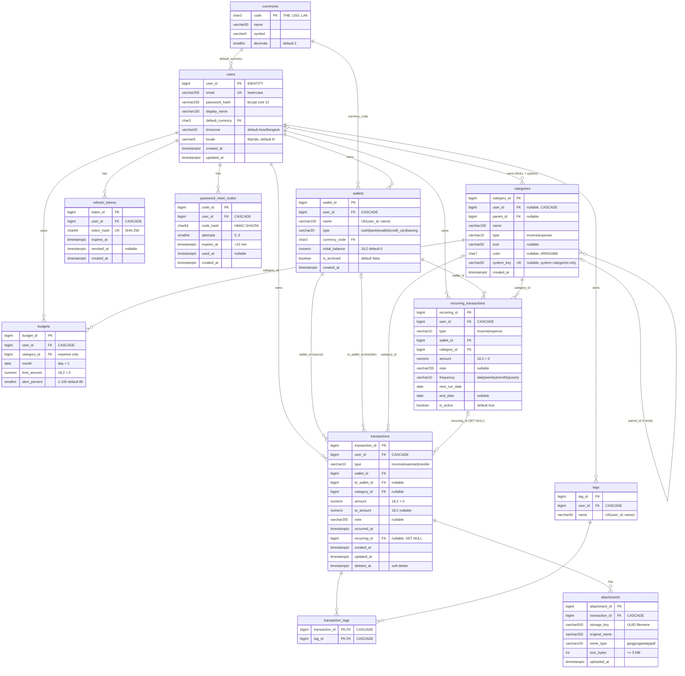

# ERD — Income & Expenses

PostgreSQL 16 · 12 ตาราง + 1 VIEW · ดูเหตุผลการออกแบบใน [design-doc.md](./design-doc.md)

## 1. Diagram



> หมายเหตุ: Mermaid ไม่รองรับวงเล็บในชื่อ type จึงเขียน `varchar255` แทน `VARCHAR(255)` และ `numeric` หมายถึง `NUMERIC(18,2)`

## 2. Constraints ทั้งหมด

### 2.1 CHECK constraints

| ตาราง                  | ชื่อ                             | เงื่อนไข                                                                 | ที่มา      |
| ---------------------- | -------------------------------- | ------------------------------------------------------------------------ | ---------- |
| users                  | `chk_users_email_lower`          | `email = lower(email)`                                                   | เพิ่ม (X2) |
| wallets                | `chk_wallets_type`               | `type IN ('cash','bank','ewallet','credit_card','saving')`               | spec       |
| categories             | `chk_categories_type`            | `type IN ('income','expense')`                                           | spec       |
| categories             | `chk_categories_color`           | `color IS NULL OR color ~ '^#[0-9A-Fa-f]{6}$'`                           | เพิ่ม (X2) |
| categories             | `chk_categories_not_self_parent` | `parent_id IS NULL OR parent_id <> category_id`                          | เพิ่ม      |
| transactions           | `chk_tx_type`                    | `type IN ('income','expense','transfer')`                                | spec       |
| transactions           | `chk_tx_amount`                  | `amount > 0`                                                             | spec       |
| transactions           | `chk_tx_shape`                   | ดูด้านล่าง                                                               | spec       |
| transactions           | `chk_tx_to_amount`               | `to_amount IS NULL OR (type = 'transfer' AND to_amount > 0)`             | เพิ่ม (X1) |
| budgets                | `chk_budgets_month_first_day`    | `EXTRACT(DAY FROM month) = 1`                                            | spec       |
| budgets                | `chk_budgets_limit`              | `limit_amount > 0`                                                       | spec       |
| budgets                | `chk_budgets_alert`              | `alert_percent BETWEEN 1 AND 100`                                        | spec       |
| recurring_transactions | `chk_rec_type`                   | `type IN ('income','expense')`                                           | spec       |
| recurring_transactions | `chk_rec_amount`                 | `amount > 0`                                                             | spec       |
| recurring_transactions | `chk_rec_frequency`              | `frequency IN ('daily','weekly','monthly','yearly')`                     | spec       |
| attachments            | `chk_att_mime`                   | `mime_type IN ('image/jpeg','image/png','image/webp','application/pdf')` | spec       |
| attachments            | `chk_att_size`                   | `size_bytes > 0 AND size_bytes <= 5242880`                               | spec + X2  |
| password_reset_codes   | `chk_reset_codes_attempts`       | `attempts BETWEEN 0 AND 5`                                               | เพิ่ม      |

```sql
-- chk_tx_shape
(type IN ('income','expense') AND category_id IS NOT NULL AND to_wallet_id IS NULL)
OR
(type = 'transfer' AND to_wallet_id IS NOT NULL AND category_id IS NULL AND to_wallet_id <> wallet_id)
```

> หมายเหตุ: **ไม่มี** CHECK `end_date >= next_run_date` เพราะตอนรอบสุดท้าย cron จะเลื่อน `next_run_date` ไปเกิน `end_date` (แล้วตั้ง `is_active = false`) ซึ่ง constraint จะขัดขวาง กฎนี้จึงตรวจแค่ใน Zod ตอนสร้าง/แก้ (design-doc X9)

### 2.2 UNIQUE

| ตาราง            | คอลัมน์                         |
| ---------------- | ------------------------------- |
| users            | `(email)`                       |
| refresh_tokens   | `(token_hash)`                  |
| wallets          | `(user_id, name)`               |
| tags             | `(user_id, name)`               |
| budgets          | `(user_id, category_id, month)` |
| transaction_tags | PK `(transaction_id, tag_id)`   |

### 2.3 Foreign keys & ON DELETE

| FK                                                                      | ON DELETE | เหตุผล                                                             |
| ----------------------------------------------------------------------- | --------- | ------------------------------------------------------------------ |
| `*.user_id → users`                                                     | CASCADE   | ลบบัญชีผู้ใช้ = ลบข้อมูลทั้งหมด (PDPA / right to be forgotten)     |
| `transactions.wallet_id / to_wallet_id → wallets`                       | NO ACTION | ลบ wallet ที่มีรายการไม่ได้ → service ตอบ 409                      |
| `transactions.category_id → categories`                                 | NO ACTION | ลบหมวดที่ถูกใช้ไม่ได้ → 409                                        |
| `categories.parent_id → categories`                                     | NO ACTION | ลบหมวดแม่ที่มีลูกไม่ได้                                            |
| `budgets.category_id`, `recurring_transactions.wallet_id / category_id` | NO ACTION | เหมือนกัน                                                          |
| `transactions.recurring_id → recurring_transactions`                    | SET NULL  | ลบแม่แบบแล้ว รายการที่เคยสร้างยังอยู่                              |
| `transaction_tags.*`, `attachments.transaction_id`                      | CASCADE   | ข้อมูลลูกไม่มีความหมายถ้าไม่มีแม่ (แต่ไฟล์จริงใน volume ต้องลบเอง) |
| `*.currency_code / default_currency → currencies`                       | RESTRICT  | ห้ามลบสกุลเงินที่ถูกใช้                                            |

> 💡 **Interview note — `RESTRICT` กับ `NO ACTION` ต่างกันอย่างไร?**
> ทั้งคู่ห้ามลบแถวแม่ที่ยังมีลูกอ้างอยู่ แต่ **`RESTRICT` ตรวจทันที** ส่วน **`NO ACTION` ตรวจตอนจบ statement**
> ตอนลบ user, PostgreSQL จะ CASCADE ลบ wallets, categories และ transactions ใน statement เดียวกัน ถ้า FK `transactions.wallet_id` เป็น RESTRICT และ Postgres บังเอิญลบ wallet ก่อน transaction จะ error ทันที แต่ NO ACTION รอให้ cascade เสร็จก่อนแล้วค่อยตรวจ ซึ่งตอนนั้นไม่มีลูกเหลือแล้ว
> ผลที่ได้คือการลบ wallet ตรงๆ ยังถูกห้ามเหมือนเดิม แต่การลบ user ทั้งคนทำงานได้เสมอ (พิสูจน์แล้วใน `prisma/sql/check-view.sql` ข้อ 4)

### 2.4 Indexes

```sql
-- จาก spec
CREATE INDEX idx_tx_user_date ON transactions (user_id, occurred_at DESC) WHERE deleted_at IS NULL;
CREATE INDEX idx_tx_wallet    ON transactions (wallet_id);
CREATE INDEX idx_tx_to_wallet ON transactions (to_wallet_id);
CREATE INDEX idx_tx_category  ON transactions (category_id);

-- เพิ่มเพื่อให้ FK lookup และ query หลักเร็ว
CREATE INDEX idx_tx_recurring         ON transactions (recurring_id);
CREATE INDEX idx_categories_user      ON categories (user_id);
CREATE INDEX idx_categories_parent    ON categories (parent_id);
CREATE INDEX idx_refresh_tokens_user  ON refresh_tokens (user_id);
CREATE INDEX idx_reset_codes_user_created ON password_reset_codes (user_id, created_at DESC);
CREATE INDEX idx_budgets_category     ON budgets (category_id);
CREATE INDEX idx_transaction_tags_tag ON transaction_tags (tag_id);
CREATE INDEX idx_attachments_tx       ON attachments (transaction_id);
CREATE INDEX idx_recurring_user       ON recurring_transactions (user_id);
CREATE INDEX idx_recurring_wallet     ON recurring_transactions (wallet_id);
CREATE INDEX idx_recurring_category   ON recurring_transactions (category_id);
CREATE INDEX idx_recurring_due        ON recurring_transactions (next_run_date) WHERE is_active;
```

ไม่มี index `wallets(user_id)`, `tags(user_id)`, `budgets(user_id)` แยก เพราะ UNIQUE `(user_id, ...)` ของตารางเหล่านั้นใช้แทนได้อยู่แล้ว (**leftmost prefix**: index `(a, b)` ใช้กับ query ที่กรองแค่ `a` ได้ แต่ใช้กับ query ที่กรองแค่ `b` ไม่ได้)

> 💡 **Interview note — PostgreSQL ไม่สร้าง index ให้ FK อัตโนมัติ** (ต่างจาก MySQL/InnoDB)
> ถ้าไม่มี index บน `transactions.wallet_id` การลบ wallet หนึ่งใบจะทำให้ Postgres ต้อง scan ทั้งตาราง transactions เพื่อเช็ค FK

## 3. VIEW `v_wallet_balances`

```sql
CREATE VIEW v_wallet_balances AS
SELECT w.wallet_id, w.user_id, w.name, w.currency_code, w.initial_balance
     + COALESCE(SUM(CASE
         WHEN t.type = 'income'                                    THEN  t.amount
         WHEN t.type = 'expense'                                   THEN -t.amount
         WHEN t.type = 'transfer' AND t.wallet_id    = w.wallet_id THEN -t.amount
         WHEN t.type = 'transfer' AND t.to_wallet_id = w.wallet_id THEN COALESCE(t.to_amount, t.amount)
       END), 0) AS balance
FROM wallets w
LEFT JOIN transactions t
       ON (t.wallet_id = w.wallet_id OR t.to_wallet_id = w.wallet_id)
      AND t.deleted_at IS NULL
GROUP BY w.wallet_id, w.user_id, w.name, w.currency_code, w.initial_balance;
```

**ตัวอย่างคำนวณมือ** (ใช้ตรวจใน Phase 2)

| รายการ                                 | wallet 1 (THB, initial 1,000) | wallet 2 (THB, initial 0) | wallet 3 (USD, initial 0) |
| -------------------------------------- | ----------------------------- | ------------------------- | ------------------------- |
| income 5,000 → w1                      | +5,000                        |                           |                           |
| expense 200 จาก w1                     | −200                          |                           |                           |
| transfer 1,000 w1 → w2                 | −1,000                        | +1,000                    |                           |
| transfer 3,500 w1 → w3 (to_amount 100) | −3,500                        |                           | +100                      |
| expense 50 จาก w2 (soft deleted)       |                               | ไม่นับ                    |                           |
| **balance**                            | **1,300.00**                  | **1,000.00**              | **100.00**                |

> 💡 **Interview note:** เงื่อนไข `t.deleted_at IS NULL` ต้องอยู่ใน `ON` ของ `LEFT JOIN` ไม่ใช่ใน `WHERE`
> ถ้าย้ายไป `WHERE` wallet ที่ไม่มีรายการเลยจะ **หายไปจากผลลัพธ์** เพราะแถวที่ `t.*` เป็น NULL จะไม่ผ่านเงื่อนไข เท่ากับ LEFT JOIN กลายเป็น INNER JOIN

> VIEW นี้ไม่ได้กรอง user ในตัวเอง repository ต้อง `WHERE user_id = $1` ทุกครั้ง

## 4. กฎทางธุรกิจ: enforce ที่ไหน

| #   | กฎ                                                        |        DB         |          Service          |           Zod            |
| --- | --------------------------------------------------------- | :---------------: | :-----------------------: | :----------------------: |
| 1   | wallet/category/tag ต้องเป็นของ user (หรือหมวดระบบ) → 404 |                   |            ✅             |                          |
| 2   | `category.type` = `transaction.type`                      |                   |            ✅             |                          |
| 3   | ข้ามสกุลต้องมี `to_amount`, สกุลเดียวกันต้องเป็น NULL     | ✅ (บางส่วน: X1)  |            ✅             |                          |
| 4   | wallet ที่ archived สร้างรายการใหม่ไม่ได้                 |                   |            ✅             |                          |
| 5   | ลบ wallet ที่มีรายการ → 409                               | ✅ (FK NO ACTION) | ✅ (ตรวจก่อนเพื่อตอบ 409) |                          |
| 6   | ลบหมวดที่ถูกใช้ → 409, แก้/ลบหมวดระบบ → 403               |      ✅ (FK)      |            ✅             |                          |
| 7   | หมวดย่อยลึก 1 ระดับ, type ตรงกับแม่                       |                   |            ✅             |                          |
| 8   | งบหมวดแม่รวมยอดหมวดย่อย                                   |                   |  ✅ (SQL ใน repository)   |                          |
| 9   | ตัดวันตาม `users.timezone`                                |                   |            ✅             |                          |
| —   | รูปแบบรายการ (transfer ต้องมี to_wallet ฯลฯ)              | ✅ `chk_tx_shape` |                           | ✅ (discriminated union) |
| —   | amount > 0, alert 1-100, month วันที่ 1                   |        ✅         |                           |            ✅            |

> 💡 **Interview note — ทำไมต้อง validate ซ้ำทั้ง Zod, service และ DB?**
> แต่ละชั้นมีหน้าที่ต่างกัน: **Zod** ให้ error ที่อ่านเข้าใจได้เร็วที่สุด, **service** ตรวจกฎที่ต้องดูข้อมูลอื่น (เช่นสกุลเงินของ wallet), **DB constraint** คือด่านสุดท้ายที่กันบั๊กในโค้ดและ script ที่เขียน DB ตรง
> กฎที่ข้ามแถว (เช่น type ของหมวดลูกต้องตรงกับแม่) ทำด้วย CHECK ไม่ได้ ต้องใช้ trigger ซึ่งเราเลือกไม่ใช้เพื่อให้ logic อยู่ที่เดียว

> ⚠️ **กฎข้อ 1 กับ race condition:** ถ้าผู้ใช้ archive wallet ในขณะเดียวกับที่สร้างรายการ อาจหลุดกฎข้อ 4 ได้ในเสี้ยววินาที ซึ่งยอมรับได้สำหรับแอปส่วนตัว (ผู้ใช้คนเดียวแข่งกับตัวเอง) ถ้าต้องเข้มงวดใช้ `SELECT ... FOR SHARE` ที่ wallet ใน `$transaction`

## 5. Implementation notes (สำหรับ Phase 2)

1. **IDENTITY vs SERIAL:** Prisma `@default(autoincrement())` บน `BigInt` จะ generate เป็น `BIGSERIAL` เราจะแก้ migration SQL เป็น `BIGINT GENERATED ALWAYS AS IDENTITY` ตาม spec (IDENTITY เป็นมาตรฐาน SQL และกัน INSERT id เองโดยไม่ตั้งใจ)
2. **Custom SQL:** CHECK constraints, VIEW และ partial index ใส่ใน migration ด้วย `prisma migrate dev --create-only` แล้วแก้ SQL เอง
3. **`updated_at`:** ใช้ `@updatedAt` ของ Prisma (อัปเดตฝั่ง application) ไม่ใช้ trigger
4. **Naming:** ตาราง/คอลัมน์ใน DB เป็น `snake_case` ส่วน Prisma model/field เป็น `camelCase` ผ่าน `@@map` / `@map`
5. **หมวดของระบบ:** `user_id IS NULL` ต้องระวังเรื่อง UNIQUE เพราะ `NULL <> NULL` ใน PostgreSQL (ตอนนี้ categories ไม่มี UNIQUE จึงไม่กระทบ แต่ถ้าจะเพิ่มต้องใช้ `NULLS NOT DISTINCT` ของ PG 15+)
